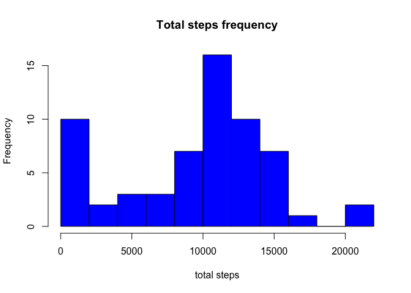
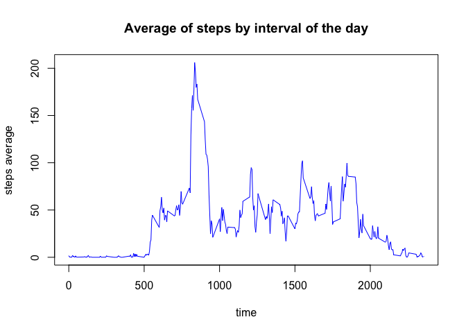
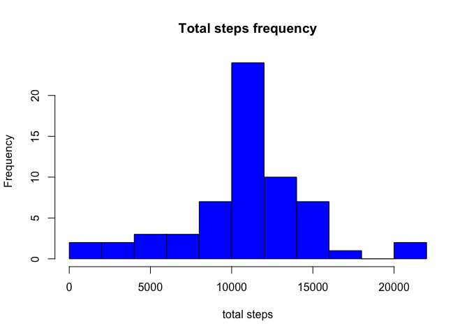
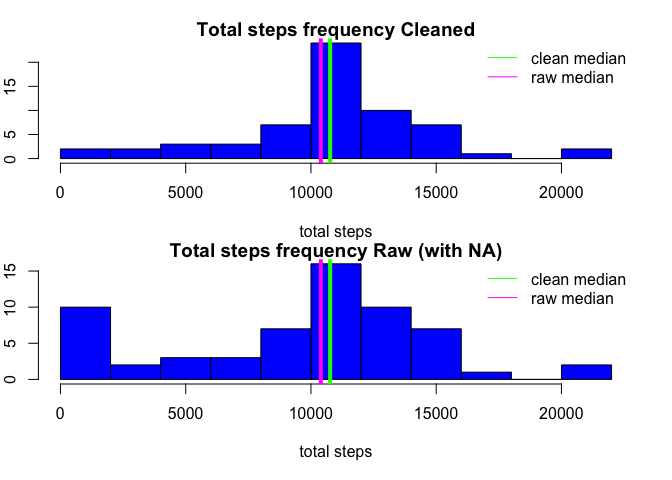
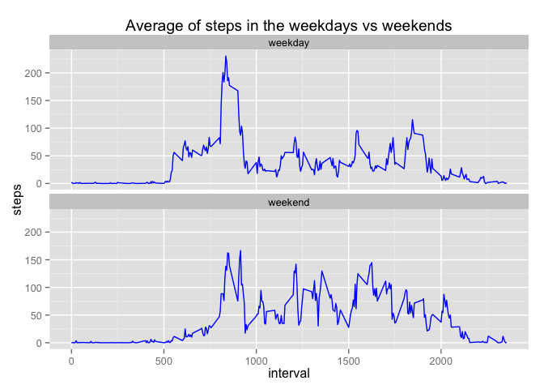

# Reproducible Research: Peer Assessment 1
DBW  


```r
library(dplyr)
```

```
## 
## Attaching package: 'dplyr'
## 
## The following object is masked from 'package:stats':
## 
##     filter
## 
## The following objects are masked from 'package:base':
## 
##     intersect, setdiff, setequal, union
```

```r
library(ggplot2)
```
## Loading and preprocessing the data
checking the data frame

```r
dataframe<-read.csv("activity.csv")
str(dataframe)
```

```
## 'data.frame':	17568 obs. of  3 variables:
##  $ steps   : int  NA NA NA NA NA NA NA NA NA NA ...
##  $ date    : Factor w/ 61 levels "2012-10-01","2012-10-02",..: 1 1 1 1 1 1 1 1 1 1 ...
##  $ interval: int  0 5 10 15 20 25 30 35 40 45 ...
```

```r
head(dataframe)
```

```
##   steps       date interval
## 1    NA 2012-10-01        0
## 2    NA 2012-10-01        5
## 3    NA 2012-10-01       10
## 4    NA 2012-10-01       15
## 5    NA 2012-10-01       20
## 6    NA 2012-10-01       25
```

```r
tail(dataframe)
```

```
##       steps       date interval
## 17563    NA 2012-11-30     2330
## 17564    NA 2012-11-30     2335
## 17565    NA 2012-11-30     2340
## 17566    NA 2012-11-30     2345
## 17567    NA 2012-11-30     2350
## 17568    NA 2012-11-30     2355
```


## What is mean total number of steps taken per day?

###for this part, we can ignore the 'NAs', so we will use the whole dataframe
First we will group the dataframe by date, then we will calculate the total steps by group (date)

```r
#grouping the data by day and calculating the total steps per day
grouped<-group_by(dataframe,date)
total<-summarize(grouped, total_steps = sum(steps, na.rm=TRUE))


#making a histogram of the total steps
hist(total$total_steps, main = "Total steps frequency", xlab="total steps", col="blue", breaks=15)
```

 

```r
#Calculate and report the mean and median of the total numer of steps taken per day

#mean of the total steps by day
mean(total$total_steps)
```

```
## [1] 9354.23
```

```r
#median of the total steps by day
median(total$total_steps)
```

```
## [1] 10395
```


## What is the average daily activity pattern?

First we should group the dataframes by interval, then calculate the average of the groups (the intervals).

```r
#calculating the average of steps in each interval, by day
intervalmean<-group_by(dataframe,interval)
intervalmean<-summarize(intervalmean, interval_mean = mean(steps, na.rm=TRUE))


#making the plot
with(intervalmean, plot(interval, interval_mean,main= "Average of steps by interval of the day", xlab="time", ylab = "steps average", type = "l",col="blue"))
```

 

```r
#finding wich time interval has the maximum average number of steps
subset(intervalmean, 
       intervalmean$interval_mean==max(intervalmean$interval_mean))[,"interval"]
```

```
## Source: local data frame [1 x 1]
## 
##   interval
## 1      835
```


## Imputing missing values
###we want the number of rows which have NA value in any of the columns of the dataframe
first we should check for NA in each column and then subset the dataframe for the columns which have NA

```r
#first we check for NA in each column
for(i in 1:ncol(dataframe)){
        print(any(is.na(dataframe[,i])))
}
```

```
## [1] TRUE
## [1] FALSE
## [1] FALSE
```

```r
#now we know only the first column has NAs
subset(dataframe ,is.na(dataframe[,1]))%>%
nrow
```

```
## [1] 2304
```
###Devising a strategy to fill the missing values
We will use the corrected average of steps by interval:
the correction is the product of the average of this interval by the percentage of the mean of that day compared with the median (50% of the values) of all the means.

```r
#calculating the mean of steps by day
daymean<-group_by(dataframe,date)
daymean<-summarize(daymean, day_mean = mean(steps, na.rm=TRUE))
head(daymean)
```

```
## Source: local data frame [6 x 2]
## 
##         date day_mean
## 1 2012-10-01      NaN
## 2 2012-10-02  0.43750
## 3 2012-10-03 39.41667
## 4 2012-10-04 42.06944
## 5 2012-10-05 46.15972
## 6 2012-10-06 53.54167
```

```r
#calculating the percentage of the mean of each day compared to the median of means of all day
daymean<-mutate(daymean, correction = day_mean/median(day_mean, na.rm=TRUE))
head(daymean, 20)
```

```
## Source: local data frame [20 x 3]
## 
##          date day_mean correction
## 1  2012-10-01      NaN        NaN
## 2  2012-10-02  0.43750  0.0117046
## 3  2012-10-03 39.41667  1.0545286
## 4  2012-10-04 42.06944  1.1254993
## 5  2012-10-05 46.15972  1.2349280
## 6  2012-10-06 53.54167  1.4324199
## 7  2012-10-07 38.24653  1.0232234
## 8  2012-10-08      NaN        NaN
## 9  2012-10-09 44.48264  1.1900604
## 10 2012-10-10 34.37500  0.9196470
## 11 2012-10-11 35.77778  0.9571760
## 12 2012-10-12 60.35417  1.6146772
## 13 2012-10-13 43.14583  1.1542963
## 14 2012-10-14 52.42361  1.4025081
## 15 2012-10-15 35.20486  0.9418486
## 16 2012-10-16 52.37500  1.4012076
## 17 2012-10-17 46.70833  1.2496052
## 18 2012-10-18 34.91667  0.9341384
## 19 2012-10-19 41.07292  1.0988388
## 20 2012-10-20 36.09375  0.9656294
```

```r
#modyfing the dataframe to have the interval mean by each interval
newdf<-left_join(dataframe, intervalmean, by="interval")
head(newdf, 20)
```

```
##    steps       date interval interval_mean
## 1     NA 2012-10-01        0     1.7169811
## 2     NA 2012-10-01        5     0.3396226
## 3     NA 2012-10-01       10     0.1320755
## 4     NA 2012-10-01       15     0.1509434
## 5     NA 2012-10-01       20     0.0754717
## 6     NA 2012-10-01       25     2.0943396
## 7     NA 2012-10-01       30     0.5283019
## 8     NA 2012-10-01       35     0.8679245
## 9     NA 2012-10-01       40     0.0000000
## 10    NA 2012-10-01       45     1.4716981
## 11    NA 2012-10-01       50     0.3018868
## 12    NA 2012-10-01       55     0.1320755
## 13    NA 2012-10-01      100     0.3207547
## 14    NA 2012-10-01      105     0.6792453
## 15    NA 2012-10-01      110     0.1509434
## 16    NA 2012-10-01      115     0.3396226
## 17    NA 2012-10-01      120     0.0000000
## 18    NA 2012-10-01      125     1.1132075
## 19    NA 2012-10-01      130     1.8301887
## 20    NA 2012-10-01      135     0.1698113
```

```r
#modyfing the dataframe to have the correction by each day
correction<-daymean[,c("date","correction")]
newdf<-left_join(newdf, correction, by="date")
set.seed(1000)
sample_n(newdf, 30)
```

```
##       steps       date interval interval_mean  correction
## 5761      0 2012-10-21        0     1.7169811 0.819414770
## 13331     0 2012-11-16      650    37.3584906 0.505434278
## 2002      0 2012-10-07     2245     0.1132075 1.023223409
## 12134     0 2012-11-12      305     0.0000000 1.000000000
## 9071     NA 2012-11-01     1150    46.0377358         NaN
## 1190      0 2012-10-05      305     0.0000000 1.234928007
## 12974     0 2012-11-15      105     0.6792453 0.003808639
## 10248     0 2012-11-05     1355    60.8113208 0.969716674
## 3789      0 2012-10-14      340     0.4905660 1.402508128
## 4498      0 2012-10-16     1445    26.0754717 1.401207617
## 6145     48 2012-10-22      800    73.3773585 1.250348351
## 13264     0 2012-11-16      115     0.3396226 0.505434278
## 5567      0 2012-10-20      750    57.8490566 0.965629354
## 15200    44 2012-11-22     1835    74.2452830 1.897538319
## 13415    33 2012-11-16     1350    47.3207547 0.505434278
## 1280      0 2012-10-05     1035    37.4150943 1.234928007
## 8647      0 2012-10-31       30     0.5283019 1.431862517
## 11148     0 2012-11-08     1655    43.6792453 0.299024617
## 1490      0 2012-10-06      405     0.9433962 1.432419879
## 17561    NA 2012-11-30     2320     0.9622642         NaN
## 2860    112 2012-10-10     2215     8.5094340 0.919647004
## 14125     0 2012-11-19      100     0.3207547 0.821272643
## 5082      0 2012-10-18     1525    47.7547170 0.934138412
## 1260    496 2012-10-05      855   167.0188679 1.234928007
## 9620    319 2012-11-03      935    45.2264151 0.981978634
## 11869     0 2012-11-11      500     0.0000000 1.171202973
## 7928     60 2012-10-28     1235    32.4150943 1.064375290
## 14456     0 2012-11-20      435     0.6603774 0.415420344
## 1593     87 2012-10-06     1240    26.5283019 1.432419879
## 2144     NA 2012-10-08     1035    37.4150943         NaN
```

###Some aesthethics
We will assume that if the correction is NaN (because there was no mean for this day), we should not correct it (corrrection = 1)

```r
#formatting the interval
#newdf$interval<-formatC(intervalmean$interval/100,digits =2,
                               #width =5, format="f", flag="0")
#removing NaNs from correction
newdf<-mutate(newdf, correction = ifelse(is.na(correction),1,correction))
set.seed(1000)
sample_n(newdf, 30)
```

```
##       steps       date interval interval_mean  correction
## 5761      0 2012-10-21        0     1.7169811 0.819414770
## 13331     0 2012-11-16      650    37.3584906 0.505434278
## 2002      0 2012-10-07     2245     0.1132075 1.023223409
## 12134     0 2012-11-12      305     0.0000000 1.000000000
## 9071     NA 2012-11-01     1150    46.0377358 1.000000000
## 1190      0 2012-10-05      305     0.0000000 1.234928007
## 12974     0 2012-11-15      105     0.6792453 0.003808639
## 10248     0 2012-11-05     1355    60.8113208 0.969716674
## 3789      0 2012-10-14      340     0.4905660 1.402508128
## 4498      0 2012-10-16     1445    26.0754717 1.401207617
## 6145     48 2012-10-22      800    73.3773585 1.250348351
## 13264     0 2012-11-16      115     0.3396226 0.505434278
## 5567      0 2012-10-20      750    57.8490566 0.965629354
## 15200    44 2012-11-22     1835    74.2452830 1.897538319
## 13415    33 2012-11-16     1350    47.3207547 0.505434278
## 1280      0 2012-10-05     1035    37.4150943 1.234928007
## 8647      0 2012-10-31       30     0.5283019 1.431862517
## 11148     0 2012-11-08     1655    43.6792453 0.299024617
## 1490      0 2012-10-06      405     0.9433962 1.432419879
## 17561    NA 2012-11-30     2320     0.9622642 1.000000000
## 2860    112 2012-10-10     2215     8.5094340 0.919647004
## 14125     0 2012-11-19      100     0.3207547 0.821272643
## 5082      0 2012-10-18     1525    47.7547170 0.934138412
## 1260    496 2012-10-05      855   167.0188679 1.234928007
## 9620    319 2012-11-03      935    45.2264151 0.981978634
## 11869     0 2012-11-11      500     0.0000000 1.171202973
## 7928     60 2012-10-28     1235    32.4150943 1.064375290
## 14456     0 2012-11-20      435     0.6603774 0.415420344
## 1593     87 2012-10-06     1240    26.5283019 1.432419879
## 2144     NA 2012-10-08     1035    37.4150943 1.000000000
```

###replacting NA steps by the corrected interval mean as explained above


```r
#if steps==NA it will make the mutation, if not it will maintain the value of steps
newdf<-mutate(newdf, steps = ifelse(is.na(steps),interval_mean*correction,steps))
head(newdf)
```

```
##       steps       date interval interval_mean correction
## 1 1.7169811 2012-10-01        0     1.7169811          1
## 2 0.3396226 2012-10-01        5     0.3396226          1
## 3 0.1320755 2012-10-01       10     0.1320755          1
## 4 0.1509434 2012-10-01       15     0.1509434          1
## 5 0.0754717 2012-10-01       20     0.0754717          1
## 6 2.0943396 2012-10-01       25     2.0943396          1
```

```r
set.seed(1000)
sample_n(newdf, 30)
```

```
##             steps       date interval interval_mean  correction
## 5761    0.0000000 2012-10-21        0     1.7169811 0.819414770
## 13331   0.0000000 2012-11-16      650    37.3584906 0.505434278
## 2002    0.0000000 2012-10-07     2245     0.1132075 1.023223409
## 12134   0.0000000 2012-11-12      305     0.0000000 1.000000000
## 9071   46.0377358 2012-11-01     1150    46.0377358 1.000000000
## 1190    0.0000000 2012-10-05      305     0.0000000 1.234928007
## 12974   0.0000000 2012-11-15      105     0.6792453 0.003808639
## 10248   0.0000000 2012-11-05     1355    60.8113208 0.969716674
## 3789    0.0000000 2012-10-14      340     0.4905660 1.402508128
## 4498    0.0000000 2012-10-16     1445    26.0754717 1.401207617
## 6145   48.0000000 2012-10-22      800    73.3773585 1.250348351
## 13264   0.0000000 2012-11-16      115     0.3396226 0.505434278
## 5567    0.0000000 2012-10-20      750    57.8490566 0.965629354
## 15200  44.0000000 2012-11-22     1835    74.2452830 1.897538319
## 13415  33.0000000 2012-11-16     1350    47.3207547 0.505434278
## 1280    0.0000000 2012-10-05     1035    37.4150943 1.234928007
## 8647    0.0000000 2012-10-31       30     0.5283019 1.431862517
## 11148   0.0000000 2012-11-08     1655    43.6792453 0.299024617
## 1490    0.0000000 2012-10-06      405     0.9433962 1.432419879
## 17561   0.9622642 2012-11-30     2320     0.9622642 1.000000000
## 2860  112.0000000 2012-10-10     2215     8.5094340 0.919647004
## 14125   0.0000000 2012-11-19      100     0.3207547 0.821272643
## 5082    0.0000000 2012-10-18     1525    47.7547170 0.934138412
## 1260  496.0000000 2012-10-05      855   167.0188679 1.234928007
## 9620  319.0000000 2012-11-03      935    45.2264151 0.981978634
## 11869   0.0000000 2012-11-11      500     0.0000000 1.171202973
## 7928   60.0000000 2012-10-28     1235    32.4150943 1.064375290
## 14456   0.0000000 2012-11-20      435     0.6603774 0.415420344
## 1593   87.0000000 2012-10-06     1240    26.5283019 1.432419879
## 2144   37.4150943 2012-10-08     1035    37.4150943 1.000000000
```

###calculating the total steps by interval, also the mean and the median of the total steps


```r
#grouping the data by day and calculating the total steps per day
gr_new<-group_by(newdf,date)
total_new<-summarize(gr_new, total_steps = sum(steps))
head(total_new,20)
```

```
## Source: local data frame [20 x 2]
## 
##          date total_steps
## 1  2012-10-01    10766.19
## 2  2012-10-02      126.00
## 3  2012-10-03    11352.00
## 4  2012-10-04    12116.00
## 5  2012-10-05    13294.00
## 6  2012-10-06    15420.00
## 7  2012-10-07    11015.00
## 8  2012-10-08    10766.19
## 9  2012-10-09    12811.00
## 10 2012-10-10     9900.00
## 11 2012-10-11    10304.00
## 12 2012-10-12    17382.00
## 13 2012-10-13    12426.00
## 14 2012-10-14    15098.00
## 15 2012-10-15    10139.00
## 16 2012-10-16    15084.00
## 17 2012-10-17    13452.00
## 18 2012-10-18    10056.00
## 19 2012-10-19    11829.00
## 20 2012-10-20    10395.00
```

```r
#making a histogram of the total steps
par(mfrow=c(1,1))
hist(total_new$total_steps, main = "Total steps frequency", xlab="total steps", col="blue", breaks=15)
```

 

```r
#Calculate and report the mean and median of the total numer of steps taken per day

#mean of the total steps by day
mean(total_new$total_steps)
```

```
## [1] 10766.19
```

```r
#median of the total steps by day
median(total_new$total_steps)
```

```
## [1] 10766.19
```
###Comparing values with NA and without NA


```r
#means
paste("Clean Data Mean:",round(mean(total_new$total_steps), digits = 2),"vs raw data (with NA) Mean:", round(mean(total$total_steps),digits=2))
```

```
## [1] "Clean Data Mean: 10766.19 vs raw data (with NA) Mean: 9354.23"
```

```r
#medians
paste("Clean Data Median:",round(median(total_new$total_steps),digits = 2),"vs raw data (with NA) Median:", round(median(total$total_steps),digits = 2))
```

```
## [1] "Clean Data Median: 10766.19 vs raw data (with NA) Median: 10395"
```

###Visualising the differences


```r
#making two histograms, one for clean data, one for raw data
par(mfrow=c(2,1),mar= c(4,1,1,1), oma=c(1,1,1,1))
hist(total_new$total_steps, main = "Total steps frequency Cleaned", xlab="total steps", col="blue", breaks=15)
abline(v=median(total_new$total_steps), col="green", lwd="4")
abline(v=median(total$total_steps), col="magenta", lwd="4")
legend("topright", lty=1, legend = c("clean median", "raw median"), col=c("green","magenta"), bty="n")

hist(total$total_steps, main = "Total steps frequency Raw (with NA)", xlab="total steps", col="blue", breaks=15)
abline(v=median(total_new$total_steps), col="green", lwd="4")
abline(v=median(total$total_steps), col="magenta", lwd="4")
legend("topright", lty=1, legend = c("clean median", "raw median"), col=c("green","magenta"), bty="n")
```

 

## Are there differences in activity patterns between weekdays and weekends?

we will first need to convert the dates to POSIXt format, than add the weekdays to the dataframe and than transform those weekdays to a new variable which differenatiaties between weekdays and weekends


```r
#formating date to POSIXt
newdf$date<-strptime(newdf$date, format = "%Y-%m-%d")
class(newdf$date)
```

```
## [1] "POSIXlt" "POSIXt"
```

```r
#adding weekdays
week_data<-mutate(newdf, weekday = weekdays(newdf$date, abbreviate = TRUE))
week_data<-select(week_data, -interval_mean, -correction)
head(week_data)
```

```
##       steps       date interval weekday
## 1 1.7169811 2012-10-01        0     Seg
## 2 0.3396226 2012-10-01        5     Seg
## 3 0.1320755 2012-10-01       10     Seg
## 4 0.1509434 2012-10-01       15     Seg
## 5 0.0754717 2012-10-01       20     Seg
## 6 2.0943396 2012-10-01       25     Seg
```

```r
#converting to weekend/weekday
week_data<-mutate(week_data, 
                  week_part = ifelse(weekday=="Sáb"|weekday=="Dom", 
                                     "weekend", "weekday"))
head(week_data)
```

```
##       steps       date interval weekday week_part
## 1 1.7169811 2012-10-01        0     Seg   weekday
## 2 0.3396226 2012-10-01        5     Seg   weekday
## 3 0.1320755 2012-10-01       10     Seg   weekday
## 4 0.1509434 2012-10-01       15     Seg   weekday
## 5 0.0754717 2012-10-01       20     Seg   weekday
## 6 2.0943396 2012-10-01       25     Seg   weekday
```

```r
#converting week_part to factor
week_data$week_part<-as.factor(week_data$week_part)
str(week_data)
```

```
## 'data.frame':	17568 obs. of  5 variables:
##  $ steps    : num  1.717 0.3396 0.1321 0.1509 0.0755 ...
##  $ date     : POSIXlt, format: "2012-10-01" "2012-10-01" ...
##  $ interval : int  0 5 10 15 20 25 30 35 40 45 ...
##  $ weekday  : chr  "Seg" "Seg" "Seg" "Seg" ...
##  $ week_part: Factor w/ 2 levels "weekday","weekend": 1 1 1 1 1 1 1 1 1 1 ...
```

##Making two panel time series of the 5-minutes interval and the average number of steps take, averaged across all weeday or weekend days

we will need to group the data by interval and then by week part to plot the panels


```r
#putting the date back to character to use the group_by function
week_data$date<-as.character(week_data$date)

#grouping by interval
grouped_week<-group_by(week_data, interval, week_part)
avg_week<-summarize(grouped_week, steps = mean(steps))
head(avg_week)
```

```
## Source: local data frame [6 x 3]
## Groups: interval
## 
##   interval week_part      steps
## 1        0   weekday 2.25115304
## 2        0   weekend 0.21462264
## 3        5   weekday 0.44528302
## 4        5   weekend 0.04245283
## 5       10   weekday 0.17316562
## 6       10   weekend 0.01650943
```

```r
#making the plot
ggplot(avg_week, aes (interval, steps))+facet_wrap(~week_part, ncol=1)+geom_line(aes(group=week_part), color = "blue")+ggtitle("Average of steps in the weekdays vs weekends")
```

 
